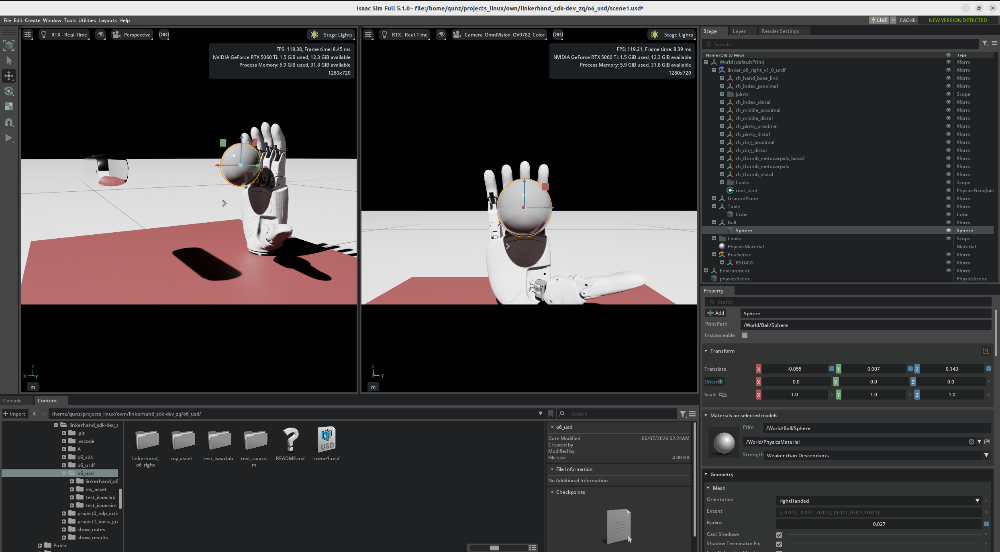
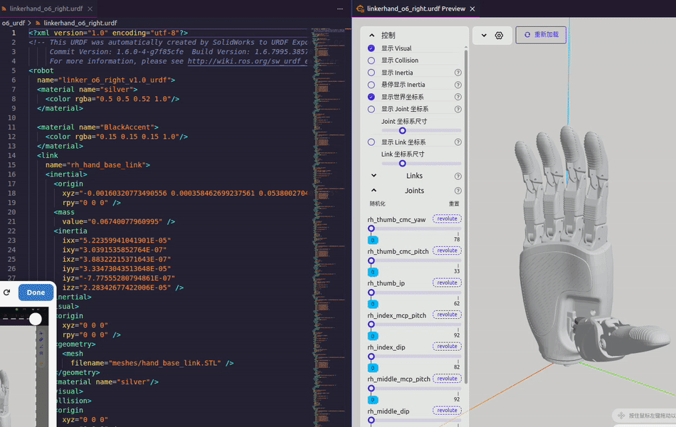
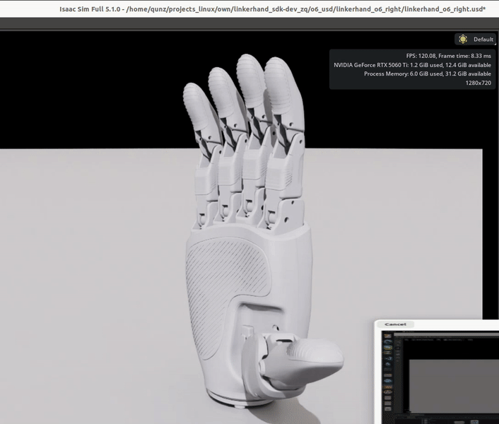
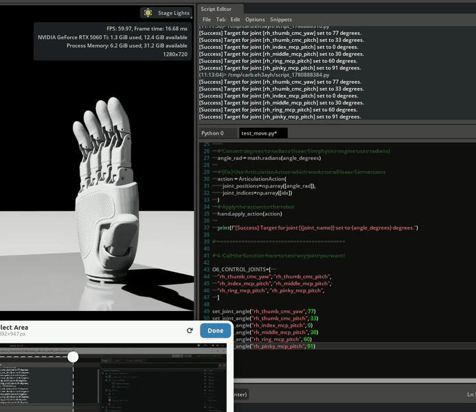

# Project：具身视觉动力学 & Linkerhand O6 Right     ——郑群 上海大学

## 🔥 News & Highlights  

- **[TODO：加入视觉模块]**：  
- **[TODO：论文复现]**：  
- **[TODO：核心模块2]**： 最简实现 Linkerhand 抓取小球 RL & Sim2Real（**关键词**：**isaac-workflow**; **RL**; **Sim2Real**; **Linkerhand 真机部署**） 
- **[2026-05-30：完成核心模块1]**： 项目前置准备（**关键词**：**sdk**; **urdf**; **usd**; **test**; **isaacsim,isaaclab**）  
- **[2026-04：完成核心模块0]**： (PS: *可忽略此模块*-前期做的探索性工作) embedding+MLP; 输入自然语言控制 Linkerhand 运动  


## 🎬 Show results

> [show_videos](./show_results)  
> [share_notes](./show_notes)  

---
---


## 项目整体结构  

### 核心模块2：子项目1(basic_grasp)  

> 本模块关注：*最简实现 Linkerhand 抓取小球*： *isaac 工作流* ; *Sim2Real* ; *Linkerhand 真机部署*  

- [README_project1(basic_grasp)](./project1_basic_grasp/README_grasp.md)  
- [环境配置_simulation](./project1_basic_grasp/o6_sim/README_sim.md)   
- [环境配置_real](./project1_basic_grasp/o6_real/README_real.md)   

```
linkerhand_sdk-dev_zq/    
├── o6_usd/              # Tool For simulation
│   └── linkerhand_o6_right/linkerhand_o6_right.usd  # Key! Isaac lab 中导入
│
├── o6_sdk/              # Tool For real
│   └── LinkerHand/      # Key！SDK 接口
│
├── project1_basic_grasp
│   ├── o6_sim/  
│   │   └── README_sim.md
│   └── o6_real/  
│       └── README_real.md
│ 
└── README_grasp.md
```


<table style="width: 100%; border-collapse: collapse; border: none;">
  <tr style="border: none;">
    <td width="100%" align="center" style="border: none;">
      
      <br><sub>test21 isaac sim：create scene & 获取环境参数</sub>
    </td>
  </tr>
</table>

<br/>

<table style="width: 100%; border-collapse: collapse; border: none;">
  <tr style="border: none;">
    <td width="50%" align="center" style="border: none;">
      
      <br><sub>test22 isaac lab：random_agent</sub>
    </td>
    <td width="50%" align="center" style="border: none;">
      
      <br><sub>test23 isaac lab：zero_agent</sub>
    </td>
  </tr>
</table>

<br/>

<table style="width: 100%; border-collapse: collapse; border: none;">
  <tr style="border: none;">
    <td width="50%" align="center" style="border: none;">
      
      <br><sub>control_direct</sub>
    </td>
    <td width="50%" align="center" style="border: none;">
      
      <br><sub>TODO: control_RL</sub>
    </td>
  </tr>
</table>


### 核心模块1：项目前期准备和测试

> 本模块实现：
>   1. 部署 sdk：后续 linkerhand o6 **实机部署**需要的接口
>   2. 配置并测试 usd：后续 linkerhand o6 **仿真**需要的独立资产
>   3. 测试 (control by isaacsim; code; isaaclab); 确保底层控制的准确性

- [README_前置准备：sdk](./o6_sdk/README_sdk.md)  
- [README_前置准备：usd & isaac 部署](./o6_usd/README.md)


<table style="width: 100%; border-collapse: collapse; border: none;">
  <tr style="border: none;">
    <td width="50%" align="center" style="border: none;">
      
      <br><sub>test11 urdf(联动关节，关节极限)</sub>
    </td>
    <td width="50%" align="center" style="border: none;">
      
      <br><sub>test12 usd（debug：联动关节，设置Articulation Root，FixedJoint，测试关节运动，测试触觉传感器）</sub>
    </td>
  </tr>
</table>

<table style="width: 100%; border-collapse: collapse; border: none;">
  <tr style="border: none;">
    <td width="33%" align="center" style="border: none;">
      
      <br><sub>test13 control by isaacsim</sub>
    </td>
    <td width="33%" align="center" style="border: none;">
      
      <br><sub>test14 control by code</sub>
    </td>    
    <td width="33%" align="center" style="border: none;">
      
      <br><sub>test15 control by isaaclab</sub>
    </td>
  </tr>
</table>


### (过时可忽略) 核心模块0_子项目0(mlp_actionhead)

> 前期做的工作：embedding+MLP; 输入自然语言控制 Linkerhand 运动  

- [README.md](./project0_mlp_actionhead/01_action_head/README.md)   

```
linkerhand_sdk-dev_zq/         
└── project0_mlp_actionhead/  
```


---
---


## 项目管理

> 总项目(linkerhand_sdk-dev_zq) 和 子项目(o6_sdk 以及 isaaclab项目) **使用同一个git维护**  

1. 删除子项目 `.git` `.gitattributes`; 并将之合并至总项目  
2. 每个子项目设置独立的 **README**; conda虚拟环境/对应配置文件  
3. 日常操作：不同子项目打开对应的**工作目录**、**虚拟环境**; 维护对应的 `.gitignore`、`.pre-commit-config.yaml` 和 `.vscode`  


## 其他工具

> (Linux): mp4 转 gif  

```bash
cd projects_linux/own/linkerhand_sdk-dev_zq/show_results/

for f in *.mp4; do ffmpeg -i "$f" -vf "fps=18,scale=-1:600:flags=lanczos,split[s0][s1];[s0]palettegen[p];[s1][p]paletteuse" -vsync 1 -an "${f%.mp4}.gif"; done
```
