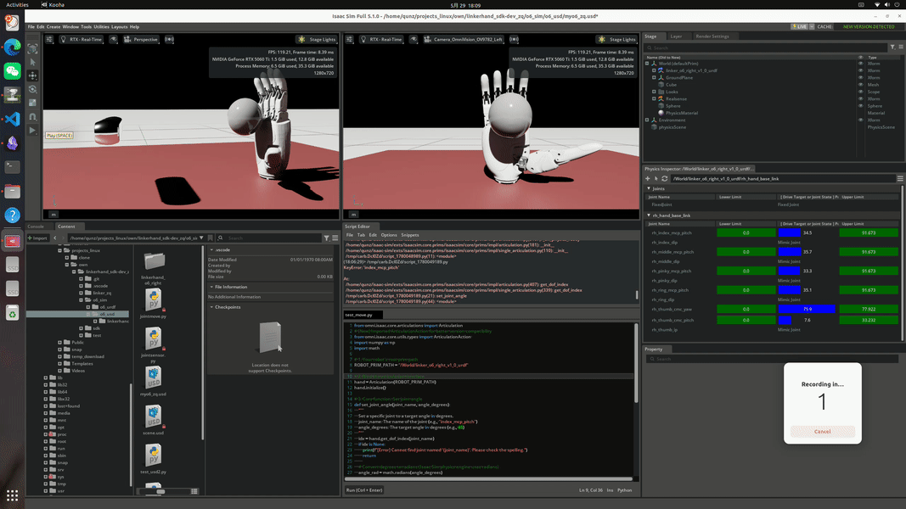

# Project：具身视觉动力学 & Linkerhand O6 Right     ——郑群 上海大学

## 🔥 News & Highlights  

> [核心结果展示-文件路径](./show_results)  
> [核心笔记分享](./show_notes)  

- **[TODO：核心模块2]**： Sim2Real最简实现Linkerhand抓取小球（关键词：*isaac 工作流*; *Sim2Real*; *Linkerhand 真机部署*） 
- **[2026-05-30：完成核心模块1]**： 项目前置准备（关键词：*sdk*; *urdf*; *usd：本地配置isaacsim,isaaclab; isaacsim场景建模*）  
- **[2026-04：完成核心模块0]**： (过时可忽略-前期做的工作) embedding+MLP; 输入自然语言控制 Linkerhand 运动  


## 🎬 Show results

<table style="width: 100%; border-collapse: collapse; border: none;">
  <tr style="border: none;">
    <td width="50%" align="center" style="border: none;">
      
      <br><sub>[module1] Isaac sim：Debug-mimic联动关节调试</sub>
    </td>
    <td width="50%" align="center" style="border: none;">
      
      <br><sub>[module1] Isaac Sim：场景建模</sub>
    </td>
  </tr>
</table>


---
---


## 项目整体结构  

### 核心模块1：Tools & 前置准备  

- [前置准备：o6_sdk 环境部署——README](./o6_sdk/README_note.md)  
- [前置准备：Isaac 环境部署——README](./o6_usd/README.md)

```
linkerhand_sdk-dev_zq/    
│     
├── o6_sdk/              # Linkerhand O6 官方 SDK;（SDK_ROOT_DIR）
│   ├── LinkerHand                          # Key！接口
│   ├── LinkerHand/config/setting.yaml      # 修改配置 (自定义)
│   ├── example/gui_control/gui_control.py  # test (官方)
│   ├── test_sdk.py                         # test (自定义)
│   └── requirements.txt
│    
├── o6_urdf/             # Linkerhand O6 官方 URDF
│    
└── o6_usd/              # Isaac Sim 构建好的通用型组件 .usd (自定义)
```


### 核心模块2：子项目1(basic_grasp)  

> 本模块关注：*最简实现 Linkerhand 抓取小球*： *isaac 工作流* ; *Sim2Real* ; *Linkerhand 真机部署*  

- [project1: README.md](./project1_basic_grasp/README_grasp.md)  
- [sim 部分：环境配置——README](./project1_basic_grasp/o6_sim/README_sim.md)   
- [real 部分：环境配置——README](./project1_basic_grasp/o6_real/README_real.md)   

```
linkerhand_sdk-dev_zq/    
├── o6_usd/              # Tool For simulation
├── o6_sdk/              # Tool For real
│   └── LinkerHand/      # Key！SDK 接口
│
├── project1_basic_grasp
│   ├── o6_sim/  
│   │   └── README_sim.md
│   └── o6_real/  
│       └── README_real.md
│ 
└── README_grasp.md
```


### (过时可忽略) 核心模块0_子项目0(mlp_actionhead)

> 前期做的工作：embedding+MLP; 输入自然语言控制 Linkerhand 运动  

- [README.md](./project0_mlp_actionhead/01_action_head/README.md)   

```
linkerhand_sdk-dev_zq/         
└── project0_mlp_actionhead/  
```


---
---


## 项目管理

> 总项目(linkerhand_sdk-dev_zq) 和 子项目(o6_sdk 以及 isaaclab项目) **使用同一个git维护**  

1. 删除子项目 `.git` `.gitattributes`; 并将之合并至总项目  
2. 每个子项目设置独立的 **README**; conda虚拟环境/对应配置文件  
3. 日常操作：不同子项目打开对应的**工作目录**、**虚拟环境**; 维护对应的 `.gitignore`、`.pre-commit-config.yaml` 和 `.vscode`  


## 其他工具

> (Linux): mp4 转 gif  

```bash
cd projects_linux/own/linkerhand_sdk-dev_zq/show_results/

for f in *.mp4; do ffmpeg -i "$f" -vf "fps=18,scale=-1:600:flags=lanczos,split[s0][s1];[s0]palettegen[p];[s1][p]paletteuse" -vsync 1 -an "${f%.mp4}.gif"; done
```


TODO:

模块0：结果展示 
模块1：usd
模块2：isaaclab 项目