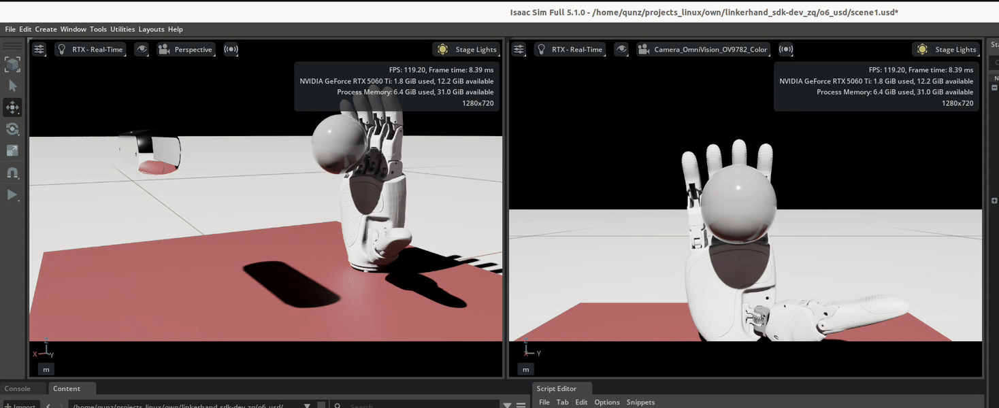
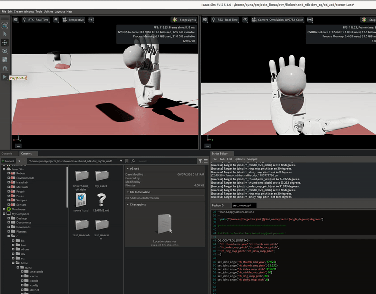

# Project：具身视觉动力学 & Linkerhand O6 Right     ——郑群 上海大学

## 🔥 News & Highlights  

- **[TODO：加入视觉模块]**：  
- **[TODO：论文复现]**：  
- **[TODO：核心模块2]**： Sim2Real最简实现Linkerhand抓取小球（关键词：*isaac 工作流*; *Sim2Real*; *Linkerhand 真机部署*） 
- **[2026-05-30：完成核心模块1]**： 项目前置准备（关键词：*sdk*; *urdf*; *本地配置isaacsim,isaaclab*; *usd：Linkerhand usd配置*; *isaacsim：场景初始化参数调试*）  
- **[2026-04：完成核心模块0]**： (PS: *可忽略此模块*-前期做的探索性工作) embedding+MLP; 输入自然语言控制 Linkerhand 运动  


## 🎬 Show results

> [核心结果展示-文件路径](./show_results)  
> [核心笔记分享](./show_notes)  


<table style="width: 100%; border-collapse: collapse; border: none;">
  <tr style="border: none;">
    <td width="50%" align="center" style="border: none;">
      
      <br><sub>control_RL</sub>
    </td>
    <td width="50%" align="center" style="border: none;">
      
      <br><sub>control_direct</sub>
    </td>
  </tr>
</table>

<br/>

<table style="width: 100%; border-collapse: collapse; border: none;">
  <tr style="border: none;">
    <td width="50%" align="center" style="border: none;">
      
      <br><sub>isaac lab：random_agent测试</sub>
    </td>
    <td width="50%" align="center" style="border: none;">
      
      <br><sub>自定义轻量化测试</sub>
    </td>
  </tr>
  <tr style="border: none;">
    <td width="50%" align="center" style="border: none;">
      
      <br><sub>测试联动关节&关节移动&极限值（通过isaac sim交互）</sub>
    </td>
    <td width="50%" align="center" style="border: none;">
      
      <br><sub>测试联动关节&关节移动&极限值（通过代码）</sub>
    </td>
  </tr>
</table>


---
---


## 项目整体结构  

### 核心模块1：项目前期准备和测试

> 本模块关注：项目前期的准备和测试，包括*真机需要的 sdk*; *isaacsim/isaaclab 配置*; *isaaclab-RL-simulation 需要的 usd* 和 *场景初始化参数调试*   

- [README_前置准备：sdk](./o6_sdk/README_sdk.md)  
- [README_前置准备：usd & isaac 部署](./o6_usd/README.md)


### 核心模块2：子项目1(basic_grasp)  

> 本模块关注：*最简实现 Linkerhand 抓取小球*： *isaac 工作流* ; *Sim2Real* ; *Linkerhand 真机部署*  

- [README_project1(basic_grasp)](./project1_basic_grasp/README_grasp.md)  
- [环境配置_simulation](./project1_basic_grasp/o6_sim/README_sim.md)   
- [环境配置_real](./project1_basic_grasp/o6_real/README_real.md)   

```
linkerhand_sdk-dev_zq/    
├── o6_usd/              # Tool For simulation
│   └── linkerhand_o6_right/linkerhand_o6_right.usd  # Key! Isaac lab 中导入
│
├── o6_sdk/              # Tool For real
│   └── LinkerHand/      # Key！SDK 接口
│
├── project1_basic_grasp
│   ├── o6_sim/  
│   │   └── README_sim.md
│   └── o6_real/  
│       └── README_real.md
│ 
└── README_grasp.md
```


### (过时可忽略) 核心模块0_子项目0(mlp_actionhead)

> 前期做的工作：embedding+MLP; 输入自然语言控制 Linkerhand 运动  

- [README.md](./project0_mlp_actionhead/01_action_head/README.md)   

```
linkerhand_sdk-dev_zq/         
└── project0_mlp_actionhead/  
```


---
---


## 项目管理

> 总项目(linkerhand_sdk-dev_zq) 和 子项目(o6_sdk 以及 isaaclab项目) **使用同一个git维护**  

1. 删除子项目 `.git` `.gitattributes`; 并将之合并至总项目  
2. 每个子项目设置独立的 **README**; conda虚拟环境/对应配置文件  
3. 日常操作：不同子项目打开对应的**工作目录**、**虚拟环境**; 维护对应的 `.gitignore`、`.pre-commit-config.yaml` 和 `.vscode`  


## 其他工具

> (Linux): mp4 转 gif  

```bash
cd projects_linux/own/linkerhand_sdk-dev_zq/show_results/

for f in *.mp4; do ffmpeg -i "$f" -vf "fps=18,scale=-1:600:flags=lanczos,split[s0][s1];[s0]palettegen[p];[s1][p]paletteuse" -vsync 1 -an "${f%.mp4}.gif"; done
```
